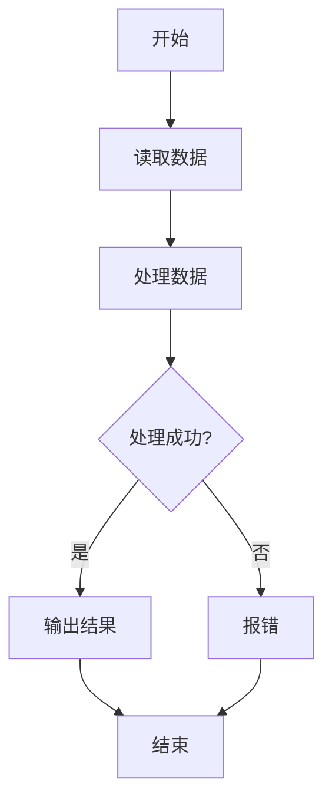
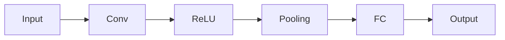

# Mermaid 流程图测试

## 基本流程图

```mermaid
flowchart TD
    A[开始] --> B[读取数据]
    B --> C[处理数据]
    C --> D{处理成功?}
    D -->|是| E[输出结果]
    D -->|否| F[报错]
    E --> G[结束]
    F --> G
```

## 机器学习流程

```mermaid
flowchart LR
    A[训练数据] --> B[模型训练]
    B --> C[源模型]
    C --> D[生成对抗样本]
    D --> E[目标模型]
    E --> F[攻击结果]
```

## 神经网络结构

```mermaid
flowchart LR
    A[Input] --> B[Conv]
    B --> C[ReLU]
    C --> D[Pooling]
    D --> E[FC]
    E --> F[Output]
```